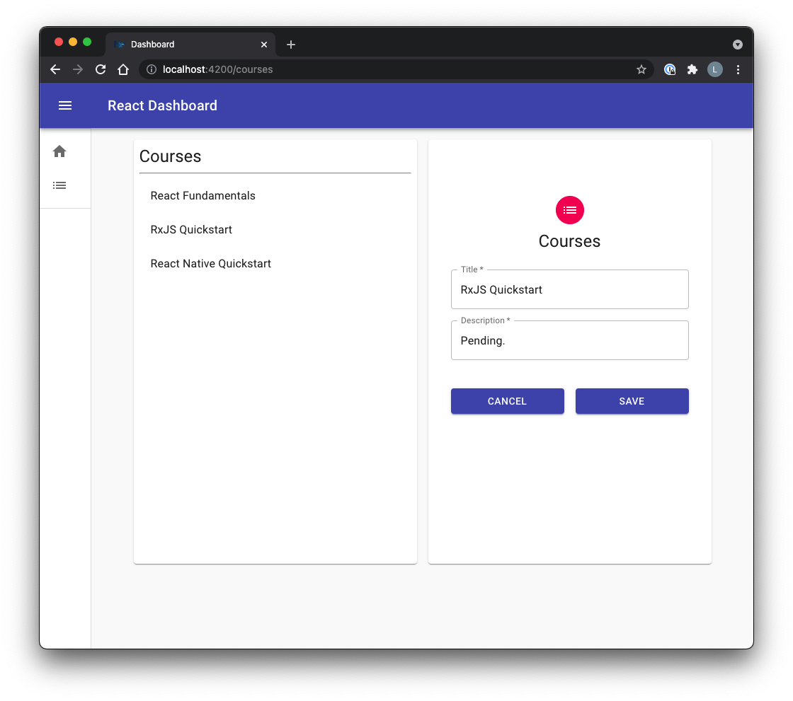

# Hello React



This is sample project for learning React.

The sample project includes a React web application with a mock RESTful API within an Nx workspace by NRWL. 

The React application uses `redux-toolkit` and `axios` libs to manage state and handle server communication. The React application also uses `material-ui` for React components and layout.

## Prerequisites
- [Git](https://git-scm.com/book/en/v2/Getting-Started-Installing-Git)
- Node.js and NPM – we recommend using [NVM (Linux/Mac)](https://github.com/creationix/nvm) or [NVM-Windows (Windows)](https://github.com/coreybutler/nvm-windows)

## Web: Getting Started

```
git clone https://github.com/simpulton/hello-react
cd hello-react
npm i
npm run serve:all
```

The `serve:all` command is a convenience methods that runs the `serve:api` and `serve:web` commands concurrently. You can run each command separately if you need to.

```
"serve:api": "nx run api:serve",
"serve:web": "nx serve --open",
"serve:all": "concurrently \"npm run serve:api\" \"npm run serve:web\""
```

The web application will open to [http://localhost:4200](http://localhost:4200) in your browser.

You can see the API by navigating to [http://localhost:3333/api/](http://localhost:3333/api/) in your browser.

> Note: the above terminal commands are for Mac. Remember to substitute the appropriate commands for your OS.


## Adding capabilities to your workspace

Nx supports many plugins which add capabilities for developing different types of applications and different tools.

These capabilities include generating applications, libraries, etc as well as the devtools to test, and build projects as well.

Below are our core plugins:

- [React](https://reactjs.org)
  - `npm install --save-dev @nrwl/react`
- Web (no framework frontends)
  - `npm install --save-dev @nrwl/web`
- [Angular](https://angular.io)
  - `npm install --save-dev @nrwl/angular`
- [Nest](https://nestjs.com)
  - `npm install --save-dev @nrwl/nest`
- [Express](https://expressjs.com)
  - `npm install --save-dev @nrwl/express`
- [Node](https://nodejs.org)
  - `npm install --save-dev @nrwl/node`

There are also many [community plugins](https://nx.dev/community) you could add.

## Generate an application

Run `nx g @nrwl/react:app my-app` to generate an application.

> You can use any of the plugins above to generate applications as well.

When using Nx, you can create multiple applications and libraries in the same workspace.

## Generate a library

Run `nx g @nrwl/react:lib my-lib` to generate a library.

> You can also use any of the plugins above to generate libraries as well.

Libraries are shareable across libraries and applications. They can be imported from `@hello-presolved/mylib`.

## Development server

Run `nx serve my-app` for a dev server. Navigate to http://localhost:4200/. The app will automatically reload if you change any of the source files.

## Code scaffolding

Run `nx g @nrwl/react:component my-component --project=my-app` to generate a new component.

## Build

Run `nx build my-app` to build the project. The build artifacts will be stored in the `dist/` directory. Use the `--prod` flag for a production build.

## Running unit tests

Run `nx test my-app` to execute the unit tests via [Jest](https://jestjs.io).

Run `nx affected:test` to execute the unit tests affected by a change.

## Running end-to-end tests

Run `ng e2e my-app` to execute the end-to-end tests via [Cypress](https://www.cypress.io).

Run `nx affected:e2e` to execute the end-to-end tests affected by a change.

## Understand your workspace

Run `nx dep-graph` to see a diagram of the dependencies of your projects.

## Further help

Visit the [Nx Documentation](https://nx.dev) to learn more.


